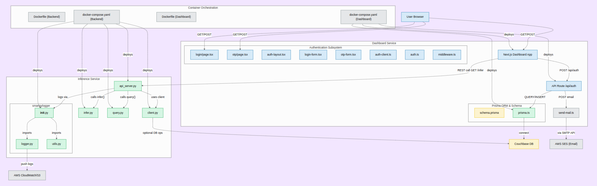

## Backend structure

## Set up backend API:

in api/:

pip install uv
uv venv
source .venv/bin/activate

uv pip install -r requirements.txt

in api/developer/:

poetry lock

poetry install

(NOW U CAN RUN main.py in developer/ to input command-line prompts)

## Run:

docker-compose up -d # With Docker

### Or:

python api_server.py # Local

TODO LIST FOR SELF:

- Remove excessive files and shit in general
- Be able to input own banned words & phrases (maybe an LLM to rewrite phrases to have a bunch of variants in preprocessing stage)
- Test how to make AI shit cheaper!
- Remove unnecessary files in developer/ (i think api and some fns in smol_dev/)
- Make PR creation a thing based off of code recommendations (probably extract selected file, proposed fix code, give to claude sonnet 4 and ask it to patch togeter, then git push from there) OBS added claude api_key to .env files btw
- Langchain ReAct logic?
- DDOS attack back to dissalowed IPs (async script to bomb the IP address x amount of times with furry porn)
- Make sure all requests input/return work!
- Dockerize properly (note: smol-dev used poetry instead of uv bombaclaat)
- Ask cursor to write comprehensive unit tests

- IMPORTANT: Test with errored out requests (400-500 code errors)

ASK FROM LUDWIG:

- 3 options select to analyze a request (summarize/explain (who did what), fix (suggest PR), find (where something originates))
- Able to copy LLM response in a click (icon type shit)
- Call it Aegis
- Make UI lowkey white and black with a secondary color (like green or magenta or somethin, ill create a cool logo)
- Create documentation (probably AI-gen) and cool ASCI art (pls remake UI to have a bunch of ASCI art and be less Enterprisey)

### Run test files

python -m tests.test_catch
